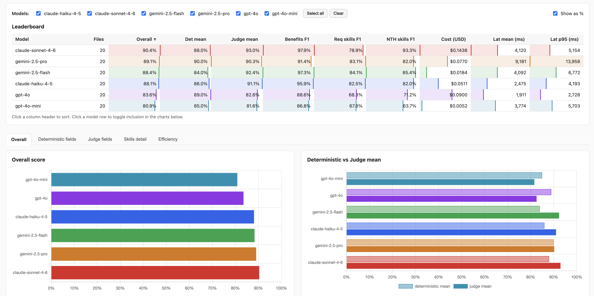

# Models Benchmark

A structured extraction benchmark that compares LLM models across Anthropic, OpenAI, and Google Gemini on a real-world NLP task: parsing job posting descriptions into a canonical JSON schema.

Each model reads plain-text job postings from `input/` and produces a JSON file per posting. Results are written to `output/<model-slug>/` and include latency, token usage, cost, and the extracted payload — making it straightforward to compare accuracy, speed, and cost across models.

## What it benchmarks

The task is structured data extraction from unstructured text. Every model receives the same system prompt and the same job posting, and must return a JSON object with these fields:

| Field                 | Description                                                                               |
| --------------------- | ----------------------------------------------------------------------------------------- |
| `title`               | Job title                                                                                 |
| `company`             | Company name                                                                              |
| `location`            | City, country, or region                                                                  |
| `remote_policy`       | `remote` / `hybrid` / `on-site` / `not specified`                                         |
| `salary_range`        | As stated in the posting, or empty string                                                 |
| `benefits`            | Array of benefits or empty array                                                          |
| `required_skills`     | Array of required skills                                                                  |
| `nice_to_have_skills` | Array of nice-to-have skills                                                              |
| `years_experience`    | Required experience, or empty string                                                      |
| `seniority`           | `intern` / `junior` / `mid` / `senior` / `lead` / `principal` / `staff` / `not specified` |

## Supported models

| Config key            | Model                     | Provider  | Mode                                         |
| --------------------- | ------------------------- | --------- | -------------------------------------------- |
| `haiku`               | claude-haiku-4-5-20251001 | Anthropic | standard                                     |
| `sonnet`              | claude-sonnet-4-6         | Anthropic | standard                                     |
| `sonnet-thinking`     | claude-sonnet-4-6         | Anthropic | extended thinking (high-effort, 3 files max) |
| `gpt4o-mini`          | gpt-4o-mini               | OpenAI    | standard                                     |
| `gpt4o`               | gpt-4o                    | OpenAI    | standard                                     |
| `o4-mini`             | o4-mini                   | OpenAI    | reasoning (high-effort, 3 files max)         |
| `gemini-flash`        | gemini-2.5-flash          | Gemini    | standard                                     |
| `gemini-pro`          | gemini-2.5-pro            | Gemini    | standard                                     |
| `gemini-pro-thinking` | gemini-2.5-pro            | Gemini    | thinking (high-effort, 3 files max)          |

**High-effort configs** (`sonnet-thinking`, `o4-mini`, `gemini-pro-thinking`) are expensive and require you to pass exactly 3 input filenames explicitly, so you can control cost.

## Prerequisites

- Node.js 20+
- API keys for the providers you want to test

## Setup

```bash
npm install
```

Create a `.env` file in the project root:

```env
ANTHROPIC_API_KEY=sk-ant-...
OPENAI_API_KEY=sk-...
GOOGLE_API_KEY=...
```

You only need the keys for the providers you intend to run.

## Input files

Place job posting descriptions as plain `.txt` files inside the `input/` folder. Files can vary in complexity — short and minimal postings, verbose multi-section descriptions, poorly formatted copy-pastes, and everything in between. Variety in complexity makes the benchmark more meaningful.

## Creating ground-truth JSONs

Before running any model, **manually read each source file in `input/` and create a corresponding ground-truth JSON** — one per posting, following the same schema described above. Store these in a separate folder (e.g. `ground_truth/`).

Hand-crafting these is intentional: automated extraction is the thing being tested, so the source of truth must come from a human reading the original text. Once you have ground-truth files you can diff model outputs against them field-by-field to measure accuracy rather than just comparing models against each other.

## Running the benchmark

Standard configs process all `.txt` files in `input/` automatically:

```bash
npm run run:haiku
npm run run:sonnet
npm run run:gpt4o-mini
npm run run:gpt4o
npm run run:gemini-flash
npm run run:gemini-pro
```

High-effort configs require exactly 3 filenames to keep costs predictable:

```bash
npm run run:sonnet:thinking -- jp1.txt jp5.txt jp12.txt
npm run run:o4-mini -- jp1.txt jp5.txt jp12.txt
npm run run:gemini-pro-thinking -- jp1.txt jp5.txt jp12.txt
```

Use the most confusing files to test with high-effort configs, preferrably when corresponding cheaper model fails to parse correctly.

## Output structure

```
output/
  claude-haiku-4-5/
    jp1.json
    jp2.json
    ...
  claude-sonnet-4-6/
    jp1.json
    ...
  claude-sonnet-4-6_high_effort/
    jp1.json
    ...
```

Each JSON file contains the full `RunResult` including extracted fields, token counts, cost, and latency.

## Evaluating results

### Requirements before evaluating

The eval pipeline scores each `(model, input file)` pair, so all three sources must be present and aligned by filename (`jpN.txt` ↔ `jpN.json`):

| Location                         | What it holds                           | How it gets there                                               |
| -------------------------------- | --------------------------------------- | --------------------------------------------------------------- |
| `input/<inputFile>.txt`          | Original posting text (source of truth) | You add these manually                                          |
| `ground_truth/<inputFile>.json`  | Reference extraction (a guide)          | Generated separately (e.g. by Claude Opus) — may contain errors |
| `output/<slug>/<inputFile>.json` | A model's `RunResult` to be scored      | Produced by the `run:*` benchmark commands                      |

A pair is only scored when **all three** exist. Pairs missing an `input/` or `ground_truth/` file are skipped with a warning.

### Command sequence

Run the benchmark first to produce model outputs, then the eval pipeline:

```bash
# 1. Generate model outputs (one or more configs)
npm run run:haiku
npm run run:gemini-pro
# ...etc

# 2. Score outputs against ground truth, then aggregate
npm run eval:all
```

`eval:all` chains the two eval stages (`eval:judge` then `eval:report`). You can also run them individually.

### Stage 1 — `eval:judge`

For each `(model, input file)` pair, scores fields against ground truth using a hybrid strategy:

- **Deterministic checks** (normalized string/range comparison, no LLM) for clean fields: `seniority`, `remote_policy`, `years_experience`, `company`, `title`.
- **LLM-as-judge** (Gemini 2.5 Pro) for fields where paraphrase and partial overlap matter: `location`, `salary_range`, `benefits`, `required_skills`, `nice_to_have_skills`. The judge sees the original posting, the reference, and the model output, and scores precision/recall on list fields. Hallucinated and missed items are recorded by name.

Results are written one JSON per pair to `eval/scores/<slug>/<inputFile>.json`. The script is **resumable** — already-scored pairs are skipped, so re-running only scores new pairs (and only the new pairs incur judge API cost).

```bash
# Score all models that have output dirs
npm run eval:judge

# Score only specific models (pass slugs)
npm run eval:judge -- claude-haiku-4-5 gemini-2.5-pro

# Score only specific input files (across selected/all models)
npm run eval:judge -- --file jp1,jp5
npm run eval:judge -- claude-haiku-4-5 --file=jp1.txt
```

Progress is printed per pair as `[<slug>] <file> → score X.XX ($Y judge cost, Zms)`, and the run ends with total pairs scored and total judge cost. Errors on individual pairs are logged and skipped rather than aborting the run.

### Stage 2 — `eval:report`

Reads all `eval/scores/**/*.json`, aggregates per model (also rolling up extraction cost/latency from `output/<slug>/*.json`), writes `eval/summary.json` (sorted by overall score descending), and prints a comparison table.

```bash
npm run eval:report
```

`eval/scores/` and `eval/summary.json` are gitignored — scores are reproducible from inputs, and the summary is regenerable from scores.

## Methodology notes

- **Reference extractions are model-generated, not hand-labeled.** They were created by Claude Opus and may contain errors. The judge is instructed to treat the original posting text as the source of truth, with the reference as a guide only — so model outputs that disagree with the reference but match the posting are scored as correct.
- **Judge model:** Gemini 2.5 Pro. Chosen because it's a different provider family from most of the evaluated models (5 of 9 are Anthropic or OpenAI), reducing self-preference bias.
- **List field scoring:** precision and recall are reported separately. Hallucinated items (in model output but not in the posting) and missed items (in the posting but absent from the model output) are listed by name in each per-pair score file, so any aggregate score is auditable.
- **Overall score weighting:** deterministic fields weight 1 each (5 total); judge string fields weight 1 each (2 total); judge list fields weight 2 each (6 total). Total weight 13. List fields are weighted higher because they are richer signals and the harder task for these models.

## Screenshot



## License

MIT
